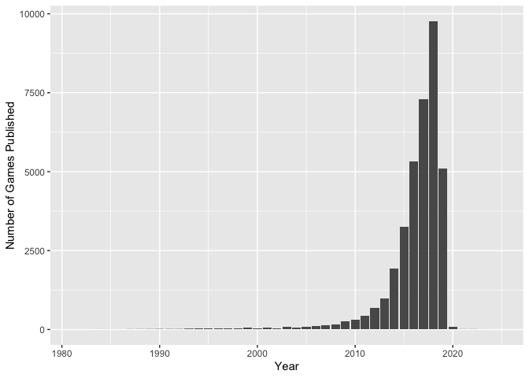

Mini Data-Analysis Deliverable 1
================

# Welcome to your (maybe) first-ever data analysis project!

And hopefully the first of many. Let’s get started:

1.  Install the [`datateachr`](https://github.com/UBC-MDS/datateachr)
    package by typing the following into your **R terminal**:

<!-- -->

    install.packages("devtools")
    devtools::install_github("UBC-MDS/datateachr")

2.  Load the packages below.

``` r
library(datateachr)
library(tidyverse)
```

    ## ── Attaching packages ─────────────────────────────────────── tidyverse 1.3.2 ──
    ## ✔ ggplot2 3.3.6      ✔ purrr   0.3.4 
    ## ✔ tibble  3.1.8      ✔ dplyr   1.0.10
    ## ✔ tidyr   1.2.1      ✔ stringr 1.4.1 
    ## ✔ readr   2.1.2      ✔ forcats 0.5.2 
    ## ── Conflicts ────────────────────────────────────────── tidyverse_conflicts() ──
    ## ✖ dplyr::filter() masks stats::filter()
    ## ✖ dplyr::lag()    masks stats::lag()

3.  Make a repository in the <https://github.com/stat545ubc-2022>
    Organization. You will be working with this repository for the
    entire data analysis project. You can either make it public, or make
    it private and add the TA’s and Lucy as collaborators. A link to
    help you create a private repository is available on the
    \#collaborative-project Slack channel.

# Instructions

## For Both Milestones

-   Each milestone is worth 45 points. The number of points allocated to
    each task will be annotated within each deliverable. Tasks that are
    more challenging will often be allocated more points.

-   10 points will be allocated to the reproducibility, cleanliness, and
    coherence of the overall analysis. While the two milestones will be
    submitted as independent deliverables, the analysis itself is a
    continuum - think of it as two chapters to a story. Each chapter, or
    in this case, portion of your analysis, should be easily followed
    through by someone unfamiliar with the content.
    [Here](https://swcarpentry.github.io/r-novice-inflammation/06-best-practices-R/)
    is a good resource for what constitutes “good code”. Learning good
    coding practices early in your career will save you hassle later on!

## For Milestone 1

**To complete this milestone**, edit [this very `.Rmd`
file](https://raw.githubusercontent.com/UBC-STAT/stat545.stat.ubc.ca/master/content/mini-project/mini-project-1.Rmd)
directly. Fill in the sections that are tagged with
`<!--- start your work below --->`.

**To submit this milestone**, make sure to knit this `.Rmd` file to an
`.md` file by changing the YAML output settings from
`output: html_document` to `output: github_document`. Commit and push
all of your work to the mini-analysis GitHub repository you made
earlier, and tag a release on GitHub. Then, submit a link to your tagged
release on canvas.

**Points**: This milestone is worth 45 points: 43 for your analysis, 1
point for having your Milestone 1 document knit error-free, and 1 point
for tagging your release on Github.

# Learning Objectives

By the end of this milestone, you should:

-   Become familiar with your dataset of choosing
-   Select 4 questions that you would like to answer with your data
-   Generate a reproducible and clear report using R Markdown
-   Become familiar with manipulating and summarizing your data in
    tibbles using `dplyr`, with a research question in mind.

# Task 1: Choose your favorite dataset (10 points)

The `datateachr` package by Hayley Boyce and Jordan Bourak currently
composed of 7 semi-tidy datasets for educational purposes. Here is a
brief description of each dataset:

-   *apt_buildings*: Acquired courtesy of The City of Toronto’s Open
    Data Portal. It currently has 3455 rows and 37 columns.

-   *building_permits*: Acquired courtesy of The City of Vancouver’s
    Open Data Portal. It currently has 20680 rows and 14 columns.

-   *cancer_sample*: Acquired courtesy of UCI Machine Learning
    Repository. It currently has 569 rows and 32 columns.

-   *flow_sample*: Acquired courtesy of The Government of Canada’s
    Historical Hydrometric Database. It currently has 218 rows and 7
    columns.

-   *parking_meters*: Acquired courtesy of The City of Vancouver’s Open
    Data Portal. It currently has 10032 rows and 22 columns.

-   *steam_games*: Acquired courtesy of Kaggle. It currently has 40833
    rows and 21 columns.

-   *vancouver_trees*: Acquired courtesy of The City of Vancouver’s Open
    Data Portal. It currently has 146611 rows and 20 columns.

**Things to keep in mind**

-   We hope that this project will serve as practice for carrying our
    your own *independent* data analysis. Remember to comment your code,
    be explicit about what you are doing, and write notes in this
    markdown document when you feel that context is required. As you
    advance in the project, prompts and hints to do this will be
    diminished - it’ll be up to you!

-   Before choosing a dataset, you should always keep in mind **your
    goal**, or in other ways, *what you wish to achieve with this data*.
    This mini data-analysis project focuses on *data wrangling*,
    *tidying*, and *visualization*. In short, it’s a way for you to get
    your feet wet with exploring data on your own.

And that is exactly the first thing that you will do!

1.1 Out of the 7 datasets available in the `datateachr` package, choose
**4** that appeal to you based on their description. Write your choices
below:

**Note**: We encourage you to use the ones in the `datateachr` package,
but if you have a dataset that you’d really like to use, you can include
it here. But, please check with a member of the teaching team to see
whether the dataset is of appropriate complexity. Also, include a
**brief** description of the dataset here to help the teaching team
understand your data.

<!-------------------------- Start your work below ---------------------------->

**1: building_permits** **2: cancer_sample** **3: flow_sample** **4:
steam_games**

<!----------------------------------------------------------------------------->

1.2 One way to narrowing down your selection is to *explore* the
datasets. Use your knowledge of dplyr to find out at least *3*
attributes about each of these datasets (an attribute is something such
as number of rows, variables, class type…). The goal here is to have an
idea of *what the data looks like*.

*Hint:* This is one of those times when you should think about the
cleanliness of your analysis. I added a single code chunk for you below,
but do you want to use more than one? Would you like to write more
comments outside of the code chunk?

<!-------------------------- Start your work below ---------------------------->

``` r
### EXPLORE HERE ###
# steam_games
steam_games
```

    ## # A tibble: 40,833 × 21
    ##       id url         types name  desc_…¹ recen…² all_r…³ relea…⁴ devel…⁵ publi…⁶
    ##    <dbl> <chr>       <chr> <chr> <chr>   <chr>   <chr>   <chr>   <chr>   <chr>  
    ##  1     1 https://st… app   DOOM  Now in… Very P… Very P… May 12… id Sof… Bethes…
    ##  2     2 https://st… app   PLAY… PLAYER… Mixed,… Mixed,… Dec 21… PUBG C… PUBG C…
    ##  3     3 https://st… app   BATT… Take c… Mixed,… Mostly… Apr 24… Harebr… Parado…
    ##  4     4 https://st… app   DayZ  The po… Mixed,… Mixed,… Dec 13… Bohemi… Bohemi…
    ##  5     5 https://st… app   EVE … EVE On… Mixed,… Mostly… May 6,… CCP     CCP,CCP
    ##  6     6 https://st… bund… Gran… Grand … NaN     NaN     NaN     Rockst… Rockst…
    ##  7     7 https://st… app   Devi… The ul… Very P… Very P… Mar 7,… CAPCOM… CAPCOM…
    ##  8     8 https://st… app   Huma… Human:… Very P… Very P… Jul 22… No Bra… Curve …
    ##  9     9 https://st… app   They… They A… Very P… Very P… Dec 12… Numant… Numant…
    ## 10    10 https://st… app   Warh… In a w… <NA>    Mixed,… May 31… Eko So… Bigben…
    ## # … with 40,823 more rows, 11 more variables: popular_tags <chr>,
    ## #   game_details <chr>, languages <chr>, achievements <dbl>, genre <chr>,
    ## #   game_description <chr>, mature_content <chr>, minimum_requirements <chr>,
    ## #   recommended_requirements <chr>, original_price <dbl>, discount_price <dbl>,
    ## #   and abbreviated variable names ¹​desc_snippet, ²​recent_reviews,
    ## #   ³​all_reviews, ⁴​release_date, ⁵​developer, ⁶​publisher

``` r
head(steam_games)
```

    ## # A tibble: 6 × 21
    ##      id url          types name  desc_…¹ recen…² all_r…³ relea…⁴ devel…⁵ publi…⁶
    ##   <dbl> <chr>        <chr> <chr> <chr>   <chr>   <chr>   <chr>   <chr>   <chr>  
    ## 1     1 https://sto… app   DOOM  Now in… Very P… Very P… May 12… id Sof… Bethes…
    ## 2     2 https://sto… app   PLAY… PLAYER… Mixed,… Mixed,… Dec 21… PUBG C… PUBG C…
    ## 3     3 https://sto… app   BATT… Take c… Mixed,… Mostly… Apr 24… Harebr… Parado…
    ## 4     4 https://sto… app   DayZ  The po… Mixed,… Mixed,… Dec 13… Bohemi… Bohemi…
    ## 5     5 https://sto… app   EVE … EVE On… Mixed,… Mostly… May 6,… CCP     CCP,CCP
    ## 6     6 https://sto… bund… Gran… Grand … NaN     NaN     NaN     Rockst… Rockst…
    ## # … with 11 more variables: popular_tags <chr>, game_details <chr>,
    ## #   languages <chr>, achievements <dbl>, genre <chr>, game_description <chr>,
    ## #   mature_content <chr>, minimum_requirements <chr>,
    ## #   recommended_requirements <chr>, original_price <dbl>, discount_price <dbl>,
    ## #   and abbreviated variable names ¹​desc_snippet, ²​recent_reviews,
    ## #   ³​all_reviews, ⁴​release_date, ⁵​developer, ⁶​publisher

``` r
dim(steam_games)
```

    ## [1] 40833    21

``` r
class(steam_games)
```

    ## [1] "spec_tbl_df" "tbl_df"      "tbl"         "data.frame"

``` r
glimpse(steam_games)
```

    ## Rows: 40,833
    ## Columns: 21
    ## $ id                       <dbl> 1, 2, 3, 4, 5, 6, 7, 8, 9, 10, 11, 12, 13, 14…
    ## $ url                      <chr> "https://store.steampowered.com/app/379720/DO…
    ## $ types                    <chr> "app", "app", "app", "app", "app", "bundle", …
    ## $ name                     <chr> "DOOM", "PLAYERUNKNOWN'S BATTLEGROUNDS", "BAT…
    ## $ desc_snippet             <chr> "Now includes all three premium DLC packs (Un…
    ## $ recent_reviews           <chr> "Very Positive,(554),- 89% of the 554 user re…
    ## $ all_reviews              <chr> "Very Positive,(42,550),- 92% of the 42,550 u…
    ## $ release_date             <chr> "May 12, 2016", "Dec 21, 2017", "Apr 24, 2018…
    ## $ developer                <chr> "id Software", "PUBG Corporation", "Harebrain…
    ## $ publisher                <chr> "Bethesda Softworks,Bethesda Softworks", "PUB…
    ## $ popular_tags             <chr> "FPS,Gore,Action,Demons,Shooter,First-Person,…
    ## $ game_details             <chr> "Single-player,Multi-player,Co-op,Steam Achie…
    ## $ languages                <chr> "English,French,Italian,German,Spanish - Spai…
    ## $ achievements             <dbl> 54, 37, 128, NA, NA, NA, 51, 55, 34, 43, 72, …
    ## $ genre                    <chr> "Action", "Action,Adventure,Massively Multipl…
    ## $ game_description         <chr> "About This Game Developed by id software, th…
    ## $ mature_content           <chr> NA, "Mature Content Description  The develope…
    ## $ minimum_requirements     <chr> "Minimum:,OS:,Windows 7/8.1/10 (64-bit versio…
    ## $ recommended_requirements <chr> "Recommended:,OS:,Windows 7/8.1/10 (64-bit ve…
    ## $ original_price           <dbl> 19.99, 29.99, 39.99, 44.99, 0.00, NA, 59.99, …
    ## $ discount_price           <dbl> 14.99, NA, NA, NA, NA, 35.18, 70.42, 17.58, N…

``` r
# cancer_sample
cancer_sample
```

    ## # A tibble: 569 × 32
    ##          ID diagnosis radius_m…¹ textu…² perim…³ area_…⁴ smoot…⁵ compa…⁶ conca…⁷
    ##       <dbl> <chr>          <dbl>   <dbl>   <dbl>   <dbl>   <dbl>   <dbl>   <dbl>
    ##  1   842302 M               18.0    10.4   123.    1001   0.118   0.278   0.300 
    ##  2   842517 M               20.6    17.8   133.    1326   0.0847  0.0786  0.0869
    ##  3 84300903 M               19.7    21.2   130     1203   0.110   0.160   0.197 
    ##  4 84348301 M               11.4    20.4    77.6    386.  0.142   0.284   0.241 
    ##  5 84358402 M               20.3    14.3   135.    1297   0.100   0.133   0.198 
    ##  6   843786 M               12.4    15.7    82.6    477.  0.128   0.17    0.158 
    ##  7   844359 M               18.2    20.0   120.    1040   0.0946  0.109   0.113 
    ##  8 84458202 M               13.7    20.8    90.2    578.  0.119   0.164   0.0937
    ##  9   844981 M               13      21.8    87.5    520.  0.127   0.193   0.186 
    ## 10 84501001 M               12.5    24.0    84.0    476.  0.119   0.240   0.227 
    ## # … with 559 more rows, 23 more variables: concave_points_mean <dbl>,
    ## #   symmetry_mean <dbl>, fractal_dimension_mean <dbl>, radius_se <dbl>,
    ## #   texture_se <dbl>, perimeter_se <dbl>, area_se <dbl>, smoothness_se <dbl>,
    ## #   compactness_se <dbl>, concavity_se <dbl>, concave_points_se <dbl>,
    ## #   symmetry_se <dbl>, fractal_dimension_se <dbl>, radius_worst <dbl>,
    ## #   texture_worst <dbl>, perimeter_worst <dbl>, area_worst <dbl>,
    ## #   smoothness_worst <dbl>, compactness_worst <dbl>, concavity_worst <dbl>, …

``` r
head(cancer_sample)
```

    ## # A tibble: 6 × 32
    ##       ID diagn…¹ radiu…² textu…³ perim…⁴ area_…⁵ smoot…⁶ compa…⁷ conca…⁸ conca…⁹
    ##    <dbl> <chr>     <dbl>   <dbl>   <dbl>   <dbl>   <dbl>   <dbl>   <dbl>   <dbl>
    ## 1 8.42e5 M          18.0    10.4   123.    1001   0.118   0.278   0.300   0.147 
    ## 2 8.43e5 M          20.6    17.8   133.    1326   0.0847  0.0786  0.0869  0.0702
    ## 3 8.43e7 M          19.7    21.2   130     1203   0.110   0.160   0.197   0.128 
    ## 4 8.43e7 M          11.4    20.4    77.6    386.  0.142   0.284   0.241   0.105 
    ## 5 8.44e7 M          20.3    14.3   135.    1297   0.100   0.133   0.198   0.104 
    ## 6 8.44e5 M          12.4    15.7    82.6    477.  0.128   0.17    0.158   0.0809
    ## # … with 22 more variables: symmetry_mean <dbl>, fractal_dimension_mean <dbl>,
    ## #   radius_se <dbl>, texture_se <dbl>, perimeter_se <dbl>, area_se <dbl>,
    ## #   smoothness_se <dbl>, compactness_se <dbl>, concavity_se <dbl>,
    ## #   concave_points_se <dbl>, symmetry_se <dbl>, fractal_dimension_se <dbl>,
    ## #   radius_worst <dbl>, texture_worst <dbl>, perimeter_worst <dbl>,
    ## #   area_worst <dbl>, smoothness_worst <dbl>, compactness_worst <dbl>,
    ## #   concavity_worst <dbl>, concave_points_worst <dbl>, symmetry_worst <dbl>, …

``` r
dim(cancer_sample)
```

    ## [1] 569  32

``` r
class(cancer_sample)
```

    ## [1] "spec_tbl_df" "tbl_df"      "tbl"         "data.frame"

``` r
glimpse(cancer_sample)
```

    ## Rows: 569
    ## Columns: 32
    ## $ ID                      <dbl> 842302, 842517, 84300903, 84348301, 84358402, …
    ## $ diagnosis               <chr> "M", "M", "M", "M", "M", "M", "M", "M", "M", "…
    ## $ radius_mean             <dbl> 17.990, 20.570, 19.690, 11.420, 20.290, 12.450…
    ## $ texture_mean            <dbl> 10.38, 17.77, 21.25, 20.38, 14.34, 15.70, 19.9…
    ## $ perimeter_mean          <dbl> 122.80, 132.90, 130.00, 77.58, 135.10, 82.57, …
    ## $ area_mean               <dbl> 1001.0, 1326.0, 1203.0, 386.1, 1297.0, 477.1, …
    ## $ smoothness_mean         <dbl> 0.11840, 0.08474, 0.10960, 0.14250, 0.10030, 0…
    ## $ compactness_mean        <dbl> 0.27760, 0.07864, 0.15990, 0.28390, 0.13280, 0…
    ## $ concavity_mean          <dbl> 0.30010, 0.08690, 0.19740, 0.24140, 0.19800, 0…
    ## $ concave_points_mean     <dbl> 0.14710, 0.07017, 0.12790, 0.10520, 0.10430, 0…
    ## $ symmetry_mean           <dbl> 0.2419, 0.1812, 0.2069, 0.2597, 0.1809, 0.2087…
    ## $ fractal_dimension_mean  <dbl> 0.07871, 0.05667, 0.05999, 0.09744, 0.05883, 0…
    ## $ radius_se               <dbl> 1.0950, 0.5435, 0.7456, 0.4956, 0.7572, 0.3345…
    ## $ texture_se              <dbl> 0.9053, 0.7339, 0.7869, 1.1560, 0.7813, 0.8902…
    ## $ perimeter_se            <dbl> 8.589, 3.398, 4.585, 3.445, 5.438, 2.217, 3.18…
    ## $ area_se                 <dbl> 153.40, 74.08, 94.03, 27.23, 94.44, 27.19, 53.…
    ## $ smoothness_se           <dbl> 0.006399, 0.005225, 0.006150, 0.009110, 0.0114…
    ## $ compactness_se          <dbl> 0.049040, 0.013080, 0.040060, 0.074580, 0.0246…
    ## $ concavity_se            <dbl> 0.05373, 0.01860, 0.03832, 0.05661, 0.05688, 0…
    ## $ concave_points_se       <dbl> 0.015870, 0.013400, 0.020580, 0.018670, 0.0188…
    ## $ symmetry_se             <dbl> 0.03003, 0.01389, 0.02250, 0.05963, 0.01756, 0…
    ## $ fractal_dimension_se    <dbl> 0.006193, 0.003532, 0.004571, 0.009208, 0.0051…
    ## $ radius_worst            <dbl> 25.38, 24.99, 23.57, 14.91, 22.54, 15.47, 22.8…
    ## $ texture_worst           <dbl> 17.33, 23.41, 25.53, 26.50, 16.67, 23.75, 27.6…
    ## $ perimeter_worst         <dbl> 184.60, 158.80, 152.50, 98.87, 152.20, 103.40,…
    ## $ area_worst              <dbl> 2019.0, 1956.0, 1709.0, 567.7, 1575.0, 741.6, …
    ## $ smoothness_worst        <dbl> 0.1622, 0.1238, 0.1444, 0.2098, 0.1374, 0.1791…
    ## $ compactness_worst       <dbl> 0.6656, 0.1866, 0.4245, 0.8663, 0.2050, 0.5249…
    ## $ concavity_worst         <dbl> 0.71190, 0.24160, 0.45040, 0.68690, 0.40000, 0…
    ## $ concave_points_worst    <dbl> 0.26540, 0.18600, 0.24300, 0.25750, 0.16250, 0…
    ## $ symmetry_worst          <dbl> 0.4601, 0.2750, 0.3613, 0.6638, 0.2364, 0.3985…
    ## $ fractal_dimension_worst <dbl> 0.11890, 0.08902, 0.08758, 0.17300, 0.07678, 0…

``` r
# flow_sample
flow_sample
```

    ## # A tibble: 218 × 7
    ##    station_id  year extreme_type month   day  flow sym  
    ##    <chr>      <dbl> <chr>        <dbl> <dbl> <dbl> <chr>
    ##  1 05BB001     1909 maximum          7     7   314 <NA> 
    ##  2 05BB001     1910 maximum          6    12   230 <NA> 
    ##  3 05BB001     1911 maximum          6    14   264 <NA> 
    ##  4 05BB001     1912 maximum          8    25   174 <NA> 
    ##  5 05BB001     1913 maximum          6    11   232 <NA> 
    ##  6 05BB001     1914 maximum          6    18   214 <NA> 
    ##  7 05BB001     1915 maximum          6    27   236 <NA> 
    ##  8 05BB001     1916 maximum          6    20   309 <NA> 
    ##  9 05BB001     1917 maximum          6    17   174 <NA> 
    ## 10 05BB001     1918 maximum          6    15   345 <NA> 
    ## # … with 208 more rows

``` r
head(flow_sample)
```

    ## # A tibble: 6 × 7
    ##   station_id  year extreme_type month   day  flow sym  
    ##   <chr>      <dbl> <chr>        <dbl> <dbl> <dbl> <chr>
    ## 1 05BB001     1909 maximum          7     7   314 <NA> 
    ## 2 05BB001     1910 maximum          6    12   230 <NA> 
    ## 3 05BB001     1911 maximum          6    14   264 <NA> 
    ## 4 05BB001     1912 maximum          8    25   174 <NA> 
    ## 5 05BB001     1913 maximum          6    11   232 <NA> 
    ## 6 05BB001     1914 maximum          6    18   214 <NA>

``` r
dim(flow_sample)
```

    ## [1] 218   7

``` r
class(flow_sample)
```

    ## [1] "tbl_df"     "tbl"        "data.frame"

``` r
glimpse(flow_sample)
```

    ## Rows: 218
    ## Columns: 7
    ## $ station_id   <chr> "05BB001", "05BB001", "05BB001", "05BB001", "05BB001", "0…
    ## $ year         <dbl> 1909, 1910, 1911, 1912, 1913, 1914, 1915, 1916, 1917, 191…
    ## $ extreme_type <chr> "maximum", "maximum", "maximum", "maximum", "maximum", "m…
    ## $ month        <dbl> 7, 6, 6, 8, 6, 6, 6, 6, 6, 6, 6, 7, 6, 6, 6, 7, 5, 7, 6, …
    ## $ day          <dbl> 7, 12, 14, 25, 11, 18, 27, 20, 17, 15, 22, 3, 9, 5, 14, 5…
    ## $ flow         <dbl> 314, 230, 264, 174, 232, 214, 236, 309, 174, 345, 185, 24…
    ## $ sym          <chr> NA, NA, NA, NA, NA, NA, NA, NA, NA, NA, NA, NA, NA, NA, N…

``` r
# building_permits
building_permits
```

    ## # A tibble: 20,680 × 14
    ##    permit_n…¹ issue_date proje…² type_…³ address proje…⁴ build…⁵ build…⁶ appli…⁷
    ##    <chr>      <date>       <dbl> <chr>   <chr>   <chr>   <chr>   <chr>   <chr>  
    ##  1 BP-2016-0… 2017-02-01  0      Salvag… 4378 W… <NA>    <NA>     <NA>   Raffae…
    ##  2 BU468090   2017-02-01  0      New Bu… 1111 R… <NA>    <NA>     <NA>   MAX KE…
    ##  3 DB-2016-0… 2017-02-01  3.5 e4 Additi… 3732 W… <NA>    <NA>     <NA>   Peter …
    ##  4 DB-2017-0… 2017-02-01  1.5 e4 Additi… 88 W P… <NA>    Mercur… "88 W … Aaron …
    ##  5 DB452250   2017-02-01  1.81e5 New Bu… 492 E … <NA>    082016… "3559 … John H…
    ##  6 BP-2016-0… 2017-02-02  0      Salvag… 3332 W… <NA>    <NA>     <NA>   Shalin…
    ##  7 BP-2016-0… 2017-02-02  1.5 e4 Demoli… 2873 W… <NA>    <NA>     <NA>   Mike C…
    ##  8 BP-2016-0… 2017-02-02  0      Salvag… 3579 E… <NA>    <NA>     <NA>   Ricci …
    ##  9 BP-2016-0… 2017-02-02  6.5 e7 New Bu… 620 CA… <NA>    <NA>     <NA>   David …
    ## 10 BP-2016-0… 2017-02-02  2.5 e4 Additi… 1868 W… <NA>    RenBui… "1868 … Daniel…
    ## # … with 20,670 more rows, 5 more variables: applicant_address <chr>,
    ## #   property_use <chr>, specific_use_category <chr>, year <dbl>, bi_id <dbl>,
    ## #   and abbreviated variable names ¹​permit_number, ²​project_value,
    ## #   ³​type_of_work, ⁴​project_description, ⁵​building_contractor,
    ## #   ⁶​building_contractor_address, ⁷​applicant

``` r
head(building_permits)
```

    ## # A tibble: 6 × 14
    ##   permit_nu…¹ issue_date proje…² type_…³ address proje…⁴ build…⁵ build…⁶ appli…⁷
    ##   <chr>       <date>       <dbl> <chr>   <chr>   <chr>   <chr>   <chr>   <chr>  
    ## 1 BP-2016-02… 2017-02-01       0 Salvag… 4378 W… <NA>    <NA>     <NA>   Raffae…
    ## 2 BU468090    2017-02-01       0 New Bu… 1111 R… <NA>    <NA>     <NA>   MAX KE…
    ## 3 DB-2016-04… 2017-02-01   35000 Additi… 3732 W… <NA>    <NA>     <NA>   Peter …
    ## 4 DB-2017-00… 2017-02-01   15000 Additi… 88 W P… <NA>    Mercur… "88 W … Aaron …
    ## 5 DB452250    2017-02-01  181178 New Bu… 492 E … <NA>    082016… "3559 … John H…
    ## 6 BP-2016-01… 2017-02-02       0 Salvag… 3332 W… <NA>    <NA>     <NA>   Shalin…
    ## # … with 5 more variables: applicant_address <chr>, property_use <chr>,
    ## #   specific_use_category <chr>, year <dbl>, bi_id <dbl>, and abbreviated
    ## #   variable names ¹​permit_number, ²​project_value, ³​type_of_work,
    ## #   ⁴​project_description, ⁵​building_contractor, ⁶​building_contractor_address,
    ## #   ⁷​applicant

``` r
dim(building_permits)
```

    ## [1] 20680    14

``` r
class(building_permits)
```

    ## [1] "spec_tbl_df" "tbl_df"      "tbl"         "data.frame"

``` r
glimpse(building_permits)
```

    ## Rows: 20,680
    ## Columns: 14
    ## $ permit_number               <chr> "BP-2016-02248", "BU468090", "DB-2016-0445…
    ## $ issue_date                  <date> 2017-02-01, 2017-02-01, 2017-02-01, 2017-…
    ## $ project_value               <dbl> 0, 0, 35000, 15000, 181178, 0, 15000, 0, 6…
    ## $ type_of_work                <chr> "Salvage and Abatement", "New Building", "…
    ## $ address                     <chr> "4378 W 9TH AVENUE, Vancouver, BC V6R 2C7"…
    ## $ project_description         <chr> NA, NA, NA, NA, NA, NA, NA, NA, NA, NA, NA…
    ## $ building_contractor         <chr> NA, NA, NA, "Mercury Contracting Ltd", "08…
    ## $ building_contractor_address <chr> NA, NA, NA, "88 W PENDER ST  \r\nUnit 2069…
    ## $ applicant                   <chr> "Raffaele & Associates DBA: Raffaele and A…
    ## $ applicant_address           <chr> "2642 East Hastings\r\nVancouver, BC  V5K …
    ## $ property_use                <chr> "Dwelling Uses", "Dwelling Uses", "Dwellin…
    ## $ specific_use_category       <chr> "One-Family Dwelling", "Multiple Dwelling"…
    ## $ year                        <dbl> 2017, 2017, 2017, 2017, 2017, 2017, 2017, …
    ## $ bi_id                       <dbl> 524, 535, 539, 541, 543, 546, 547, 548, 54…

<!----------------------------------------------------------------------------->

1.3 Now that you’ve explored the 4 datasets that you were initially most
interested in, let’s narrow it down to 2. What lead you to choose these
2? Briefly explain your choices below, and feel free to include any code
in your explanation.

<!-------------------------- Start your work below ---------------------------->

**1: flow_sample** **2: steam_games**

Explanation: Compared with the rest of the datasets, these two datasets
seem to be interesting. `flow_sample` dataset contains a relatively
small features to analyze while keeping the features easy to understand
and to analyze trends compared with `cancer_sample` which involves a lot
of mathematical results and complex features. `steam_games` dataset is
very interesting naturally because this dataset contains a lot of specs
of different game and interesting features such as the minimum
requirement to operate the game in different operating system and the
price of different games which is intuitive to have some analysis based
on these features compared with `building_permits`.
<!----------------------------------------------------------------------------->

1.4 Time for the final decision! Going back to the beginning, it’s
important to have an *end goal* in mind. For example, if I had chosen
the `titanic` dataset for my project, I might’ve wanted to explore the
relationship between survival and other variables. Try to think of 1
research question that you would want to answer with each dataset. Note
them down below, and make your final choice based on what seems more
interesting to you!

<!-------------------------- Start your work below ---------------------------->

Research Question: My final decision is to choose **steam_games**
dataset. I am interested in exploring the relationship and patterns
between the price of the game and other features such as genre,
publisher, reviews, etc.
<!----------------------------------------------------------------------------->

# Important note

Read Tasks 2 and 3 *fully* before starting to complete either of them.
Probably also a good point to grab a coffee to get ready for the fun
part!

This project is semi-guided, but meant to be *independent*. For this
reason, you will complete tasks 2 and 3 below (under the **START HERE**
mark) as if you were writing your own exploratory data analysis report,
and this guidance never existed! Feel free to add a brief introduction
section to your project, format the document with markdown syntax as you
deem appropriate, and structure the analysis as you deem appropriate.
Remember, marks will be awarded for completion of the 4 tasks, but 10
points of the whole project are allocated to a reproducible and clean
analysis. If you feel lost, you can find a sample data analysis
[here](https://www.kaggle.com/headsortails/tidy-titarnic) to have a
better idea. However, bear in mind that it is **just an example** and
you will not be required to have that level of complexity in your
project.

# Task 2: Exploring your dataset (15 points)

If we rewind and go back to the learning objectives, you’ll see that by
the end of this deliverable, you should have formulated *4* research
questions about your data that you may want to answer during your
project. However, it may be handy to do some more exploration on your
dataset of choice before creating these questions - by looking at the
data, you may get more ideas. **Before you start this task, read all
instructions carefully until you reach START HERE under Task 3**.

2.1 Complete *4 out of the following 8 exercises* to dive deeper into
your data. All datasets are different and therefore, not all of these
tasks may make sense for your data - which is why you should only answer
*4*. Use *dplyr* and *ggplot*.

1.  Plot the distribution of a numeric variable.
2.  Create a new variable based on other variables in your data (only if
    it makes sense)
3.  Investigate how many missing values there are per variable. Can you
    find a way to plot this?
4.  Explore the relationship between 2 variables in a plot.
5.  Filter observations in your data according to your own criteria.
    Think of what you’d like to explore - again, if this was the
    `titanic` dataset, I may want to narrow my search down to passengers
    born in a particular year…
6.  Use a boxplot to look at the frequency of different observations
    within a single variable. You can do this for more than one variable
    if you wish!
7.  Make a new tibble with a subset of your data, with variables and
    observations that you are interested in exploring.
8.  Use a density plot to explore any of your variables (that are
    suitable for this type of plot).

2.2 For each of the 4 exercises that you complete, provide a *brief
explanation* of why you chose that exercise in relation to your data (in
other words, why does it make sense to do that?), and sufficient
comments for a reader to understand your reasoning and code.

<!-------------------------- Start your work below ---------------------------->

``` r
# 1.  Plot the distribution of a numeric variable.
original_price_distribution <- ggplot(steam_games, aes(original_price, ..density..)) +
                                    geom_histogram() +
                                    xlim(0, 50) # plot the distribution of the original price of the game and set the limit of x-axis to range between 0 to 50
print(original_price_distribution)
```

    ## `stat_bin()` using `bins = 30`. Pick better value with `binwidth`.

    ## Warning: Removed 6496 rows containing non-finite values (stat_bin).

    ## Warning: Removed 2 rows containing missing values (geom_bar).

<!-- -->

``` r
# Conclusion: most of the games in Steam are free or below 50 dollars
```

``` r
# 2.  Create a new variable based on other variables in your data (only if it makes sense)
glimpse(steam_games) # take a look at the dataset
```

    ## Rows: 40,833
    ## Columns: 21
    ## $ id                       <dbl> 1, 2, 3, 4, 5, 6, 7, 8, 9, 10, 11, 12, 13, 14…
    ## $ url                      <chr> "https://store.steampowered.com/app/379720/DO…
    ## $ types                    <chr> "app", "app", "app", "app", "app", "bundle", …
    ## $ name                     <chr> "DOOM", "PLAYERUNKNOWN'S BATTLEGROUNDS", "BAT…
    ## $ desc_snippet             <chr> "Now includes all three premium DLC packs (Un…
    ## $ recent_reviews           <chr> "Very Positive,(554),- 89% of the 554 user re…
    ## $ all_reviews              <chr> "Very Positive,(42,550),- 92% of the 42,550 u…
    ## $ release_date             <chr> "May 12, 2016", "Dec 21, 2017", "Apr 24, 2018…
    ## $ developer                <chr> "id Software", "PUBG Corporation", "Harebrain…
    ## $ publisher                <chr> "Bethesda Softworks,Bethesda Softworks", "PUB…
    ## $ popular_tags             <chr> "FPS,Gore,Action,Demons,Shooter,First-Person,…
    ## $ game_details             <chr> "Single-player,Multi-player,Co-op,Steam Achie…
    ## $ languages                <chr> "English,French,Italian,German,Spanish - Spai…
    ## $ achievements             <dbl> 54, 37, 128, NA, NA, NA, 51, 55, 34, 43, 72, …
    ## $ genre                    <chr> "Action", "Action,Adventure,Massively Multipl…
    ## $ game_description         <chr> "About This Game Developed by id software, th…
    ## $ mature_content           <chr> NA, "Mature Content Description  The develope…
    ## $ minimum_requirements     <chr> "Minimum:,OS:,Windows 7/8.1/10 (64-bit versio…
    ## $ recommended_requirements <chr> "Recommended:,OS:,Windows 7/8.1/10 (64-bit ve…
    ## $ original_price           <dbl> 19.99, 29.99, 39.99, 44.99, 0.00, NA, 59.99, …
    ## $ discount_price           <dbl> 14.99, NA, NA, NA, NA, 35.18, 70.42, 17.58, N…

``` r
steam_games_prices <- select(steam_games, name, original_price, discount_price) # select columns containing prices
print(steam_games_prices) # take a look of the subset
```

    ## # A tibble: 40,833 × 3
    ##    name                                       original_price discount_price
    ##    <chr>                                               <dbl>          <dbl>
    ##  1 DOOM                                                 20.0           15.0
    ##  2 PLAYERUNKNOWN'S BATTLEGROUNDS                        30.0           NA  
    ##  3 BATTLETECH                                           40.0           NA  
    ##  4 DayZ                                                 45.0           NA  
    ##  5 EVE Online                                            0             NA  
    ##  6 Grand Theft Auto V: Premium Online Edition           NA             35.2
    ##  7 Devil May Cry 5                                      60.0           70.4
    ##  8 Human: Fall Flat                                     15.0           17.6
    ##  9 They Are Billions                                    30.0           NA  
    ## 10 Warhammer: Chaosbane                                 50.0           NA  
    ## # … with 40,823 more rows

``` r
steam_games_discount_rate <- steam_games_prices %>%
                                mutate(discount_rate = (original_price - discount_price) / original_price) # calculate the discount rate based on the price difference
print(steam_games_discount_rate) # print out the result containing the new column
```

    ## # A tibble: 40,833 × 4
    ##    name                                       original_price discount_…¹ disco…²
    ##    <chr>                                               <dbl>       <dbl>   <dbl>
    ##  1 DOOM                                                 20.0        15.0   0.250
    ##  2 PLAYERUNKNOWN'S BATTLEGROUNDS                        30.0        NA    NA    
    ##  3 BATTLETECH                                           40.0        NA    NA    
    ##  4 DayZ                                                 45.0        NA    NA    
    ##  5 EVE Online                                            0          NA    NA    
    ##  6 Grand Theft Auto V: Premium Online Edition           NA          35.2  NA    
    ##  7 Devil May Cry 5                                      60.0        70.4  -0.174
    ##  8 Human: Fall Flat                                     15.0        17.6  -0.173
    ##  9 They Are Billions                                    30.0        NA    NA    
    ## 10 Warhammer: Chaosbane                                 50.0        NA    NA    
    ## # … with 40,823 more rows, and abbreviated variable names ¹​discount_price,
    ## #   ²​discount_rate

``` r
# 3.  Investigate how many missing values there are per variable. Can you find a way to plot this?
steam_games %>%
    summarise_all(list(~is.na(.))) %>% # convert this data frame to a boolean data frame
    pivot_longer(everything(), names_to = "variables", values_to="missing") %>% #
    count(variables, missing) %>% # compute missing and non-missing values for each column
    ggplot(aes(y=variables,x=n,fill=missing)) +
    geom_col(position = "fill") # plot
```

<!-- -->

``` r
# 5.  Filter observations in your data according to your own criteria. Think of what you'd like to explore - again, if this was the `titanic` dataset, I may want to narrow my search down to passengers born in a particular year...
game_languages <- steam_games %>%
                    select(name, languages) %>%
                    filter(grepl("Chinese", languages))
print(game_languages) # I am selecting all the games that support my home language (in my case: Chinese) to analyze and I observed that 9359 out of 40833 games in this dataset supports Chinese as one of the game languages.
```

    ## # A tibble: 9,359 × 2
    ##    name                                       languages                         
    ##    <chr>                                      <chr>                             
    ##  1 DOOM                                       English,French,Italian,German,Spa…
    ##  2 PLAYERUNKNOWN'S BATTLEGROUNDS              English,Korean,Simplified Chinese…
    ##  3 DayZ                                       English,French,Italian,German,Spa…
    ##  4 Grand Theft Auto V: Premium Online Edition English, French, Italian, German,…
    ##  5 Devil May Cry 5                            English,French,Italian,German,Spa…
    ##  6 Human: Fall Flat                           English,French,German,Spanish - S…
    ##  7 They Are Billions                          English,Spanish - Spain,French,Ge…
    ##  8 Warhammer: Chaosbane                       English,French,Italian,German,Spa…
    ##  9 For The King                               English,French,Italian,German,Spa…
    ## 10 Danganronpa V3: Killing Harmony            English,French,Japanese,Simplifie…
    ## # … with 9,349 more rows

<!----------------------------------------------------------------------------->

# Task 3: Write your research questions (5 points)

So far, you have chosen a dataset and gotten familiar with it through
exploring the data. Now it’s time to figure out 4 research questions
that you would like to answer with your data! Write the 4 questions and
any additional comments at the end of this deliverable. These questions
are not necessarily set in stone - TAs will review them and give you
feedback; therefore, you may choose to pursue them as they are for the
rest of the project, or make modifications!

<!--- *****START HERE***** --->

Data set:*steam_games*

-   Research question 1: Analyze the trend of the number of games
    published in each year, is it increasing or decreasing?

-   Research question 2: What’s the average price of games published in
    each year?

-   Research question 3: Is there any relationship between the game
    genre and the price of the game?

-   Research question 4: Is there any relationship between the reviews
    and the price of the game?
    <!----------------------------------------------------------------------------->
    \# Task 4: Process and summarize your data (13 points)

From Task 2, you should have an idea of the basic structure of your
dataset (e.g. number of rows and columns, class types, etc.). Here, we
will start investigating your data more in-depth using various data
manipulation functions.

### 1.1 (10 points)

Now, for each of your four research questions, choose one task from
options 1-4 (summarizing), and one other task from 4-8 (graphing). You
should have 2 tasks done for each research question (8 total). Make sure
it makes sense to do them! (e.g. don’t use a numerical variables for a
task that needs a categorical variable.). Comment on why each task helps
(or doesn’t!) answer the corresponding research question.

Ensure that the output of each operation is printed!

**Summarizing:**

1.  Compute the *range*, *mean*, and *two other summary statistics* of
    **one numerical variable** across the groups of **one categorical
    variable** from your data.
2.  Compute the number of observations for at least one of your
    categorical variables. Do not use the function `table()`!
3.  Create a categorical variable with 3 or more groups from an existing
    numerical variable. You can use this new variable in the other
    tasks! *An example: age in years into “child, teen, adult, senior”.*
4.  Based on two categorical variables, calculate two summary statistics
    of your choosing.

**Graphing:**

5.  Create a graph out of summarized variables that has at least two
    geom layers.
6.  Create a graph of your choosing, make one of the axes logarithmic,
    and format the axes labels so that they are “pretty” or easier to
    read.
7.  Make a graph where it makes sense to customize the alpha
    transparency.
8.  Create 3 histograms out of summarized variables, with each histogram
    having different sized bins. Pick the “best” one and explain why it
    is the best.

Make sure it’s clear what research question you are doing each operation
for!

<!------------------------- Start your work below ----------------------------->

*Research question 1:* Analyze the trend of the number of games
published in each year, is it increasing or decreasing? **Summarizing:**
Create a categorical variable with 3 or more groups from an existing
numerical variable. You can use this new variable in the other tasks!

``` r
steam_games$year <- as.integer(sub('.*,\\s*', '', steam_games$release_date))
```

    ## Warning: NAs introduced by coercion

``` r
games_per_year <- as_tibble(count(steam_games, year))
print(games_per_year)
```

    ## # A tibble: 46 × 2
    ##     year     n
    ##    <int> <int>
    ##  1     0  3176
    ##  2  1981     1
    ##  3  1983     1
    ##  4  1984     2
    ##  5  1985     1
    ##  6  1986     1
    ##  7  1987     4
    ##  8  1988     5
    ##  9  1989     6
    ## 10  1990     9
    ## # … with 36 more rows

**Graphing:** Create a graph out of summarized variables that has at
least two geom layers.

``` r
ggplot(games_per_year) +
    geom_bar(aes(year, weight = n)) +
    xlim(1981, 2025) +
    xlab("Year") +
    ylab("Number of Games Published")
```

    ## Warning: Removed 3 rows containing non-finite values (stat_count).

    ## Warning: Removed 2 rows containing missing values (geom_bar).

<!-- -->

*Research question 2:* What’s the average price of games published in
each year? **Summarizing:** Create a categorical variable with 3 or more
groups from an existing numerical variable. You can use this new
variable in the other tasks!

``` r
average_price_each_year <- steam_games %>%
                                group_by(year) %>%
                                summarise(original_price_mean = mean(original_price, na.rm = TRUE))
print(average_price_each_year)
```

    ## # A tibble: 46 × 2
    ##     year original_price_mean
    ##    <int>               <dbl>
    ##  1     0               35.5 
    ##  2  1981                0   
    ##  3  1983                9.99
    ##  4  1984                5.99
    ##  5  1985               55.9 
    ##  6  1986                7.99
    ##  7  1987                5.25
    ##  8  1988                6.39
    ##  9  1989               12.0 
    ## 10  1990               19.6 
    ## # … with 36 more rows

**Graphing:** Create a graph out of summarized variables that has at
least two geom layers.

``` r
ggplot(average_price_each_year) +
    geom_bar(aes(year, weight = original_price_mean)) +
    xlim(1981, 2025) +
    xlab("Year") +
    ylab("Average Price Per Game")
```

    ## Warning: Removed 3 rows containing non-finite values (stat_count).

    ## Warning: Removed 2 rows containing missing values (geom_bar).

<!-- -->

*Research question 3:* Is there any relationship between the game genre
and the price of the game? **Summarizing:** Create a categorical
variable with 3 or more groups from an existing numerical variable. You
can use this new variable in the other tasks!

``` r
games_with_first_genre <- steam_games %>%
                            mutate(first_genre = gsub(",.*$", "", genre)) %>%
                            select(name, first_genre, year, original_price)
games_subset <- filter(games_with_first_genre, first_genre %in% c("Action", "Adventure", "Racing", "RPG"))
print(games_subset)
```

    ## # A tibble: 24,545 × 4
    ##    name                                       first_genre  year original_price
    ##    <chr>                                      <chr>       <int>          <dbl>
    ##  1 DOOM                                       Action       2016           20.0
    ##  2 PLAYERUNKNOWN'S BATTLEGROUNDS              Action       2017           30.0
    ##  3 BATTLETECH                                 Action       2018           40.0
    ##  4 DayZ                                       Action       2018           45.0
    ##  5 EVE Online                                 Action       2003            0  
    ##  6 Grand Theft Auto V: Premium Online Edition Action          0           NA  
    ##  7 Devil May Cry 5                            Action       2019           60.0
    ##  8 Human: Fall Flat                           Adventure    2016           15.0
    ##  9 Warhammer: Chaosbane                       Action       2019           50.0
    ## 10 For The King                               Adventure    2018           20.0
    ## # … with 24,535 more rows

**Graphing:** Make a graph where it makes sense to customize the alpha
transparency.

``` r
ggplot(games_subset, aes(x = year, y = original_price)) +
                 geom_point(aes(color = first_genre),
                                        size = 2,
                                        alpha = 1) +
                    xlim(1981, 2025) +
                    ylim(0, 50)
```

    ## Warning: Removed 4527 rows containing missing values (geom_point).

<!-- -->

*Research question 4:* Is there any relationship between the reviews and
the price of the game? **Summarizing:** Create a categorical variable
with 3 or more groups from an existing numerical variable. You can use
this new variable in the other tasks!

``` r
level_of_review <- steam_games %>%
                        mutate(review_level = gsub(",.*$", "", all_reviews)) %>%
                        select(name, review_level, original_price)
print(level_of_review)
```

    ## # A tibble: 40,833 × 3
    ##    name                                       review_level    original_price
    ##    <chr>                                      <chr>                    <dbl>
    ##  1 DOOM                                       Very Positive             20.0
    ##  2 PLAYERUNKNOWN'S BATTLEGROUNDS              Mixed                     30.0
    ##  3 BATTLETECH                                 Mostly Positive           40.0
    ##  4 DayZ                                       Mixed                     45.0
    ##  5 EVE Online                                 Mostly Positive            0  
    ##  6 Grand Theft Auto V: Premium Online Edition NaN                       NA  
    ##  7 Devil May Cry 5                            Very Positive             60.0
    ##  8 Human: Fall Flat                           Very Positive             15.0
    ##  9 They Are Billions                          Very Positive             30.0
    ## 10 Warhammer: Chaosbane                       Mixed                     50.0
    ## # … with 40,823 more rows

**Graphing:** Create a graph out of summarized variables that has at
least two geom layers.

``` r
level_of_review %>%
  group_by(review_level) %>%
  summarise(original_price_mean = mean(original_price, na.rm = TRUE))
```

    ## # A tibble: 20 × 2
    ##    review_level            original_price_mean
    ##    <chr>                                 <dbl>
    ##  1 1 user reviews                        10.6 
    ##  2 2 user reviews                        12.6 
    ##  3 3 user reviews                        11.4 
    ##  4 4 user reviews                        12.2 
    ##  5 5 user reviews                        14.1 
    ##  6 6 user reviews                        11.5 
    ##  7 7 user reviews                        14.6 
    ##  8 8 user reviews                        11.9 
    ##  9 9 user reviews                        12.1 
    ## 10 Mixed                                 16.0 
    ## 11 Mostly Negative                       12.2 
    ## 12 Mostly Positive                       16.4 
    ## 13 NaN                                   42.3 
    ## 14 Negative                              10.3 
    ## 15 Overwhelmingly Negative                9.13
    ## 16 Overwhelmingly Positive               14.9 
    ## 17 Positive                             202.  
    ## 18 Very Negative                         13.1 
    ## 19 Very Positive                         15.0 
    ## 20 <NA>                                 115.

``` r
ggplot(level_of_review, aes(x = original_price)) + 
    geom_density(aes(group=review_level, color=review_level)) +
    xlim(0, 50)
```

    ## Warning: Removed 6496 rows containing non-finite values (stat_density).

<!-- -->

<!----------------------------------------------------------------------------->

### 1.2 (3 points)

Based on the operations that you’ve completed, how much closer are you
to answering your research questions? Think about what aspects of your
research questions remain unclear. Can your research questions be
refined, now that you’ve investigated your data a bit more? Which
research questions are yielding interesting results?

<!-------------------------- Start your work below ---------------------------->

**Research question 1**: Analyze the trend of the number of games
published in each year, is it increasing or decreasing? **- Comment**:
It seems like in recent years before covid-19, the number of games
published in each year is increasing. However, covid-19 affected the
number of games published but we could predict that it will keep
recovering and increase gradually in the following years. **Research
question 2**: What’s the average price of games published in each year?
**- Comment**: This question could be answered clearly by observing the
bar plot with highest height, and this appears in year of 2019.
**Research question 3**: Is there any relationship between the game
genre and the price of the game? **- Comment**: Unfortunately, our
analysis cannot conclude any useful pattern based on the graph we
generated, however, we could say each genre has a similar distribution
in which there is few games that has high prices (around 50 dollars)
while the majority is not expensive (around 10-20 dollars). **Research
question 4**: Is there any relationship between the reviews and the
price of the game? **- Comment**: Unfortunately the plot we generated
does not give us any useful pattern so we could not answer this question
with certainty at this point. Some obvious observations may include that
the majority of games that received a overwhelming negative reviews are
not expensive in general (around 10-20 dollars).
<!----------------------------------------------------------------------------->

### Attribution

Thanks to Icíar Fernández Boyano for mostly putting this together, and
Vincenzo Coia for launching.
